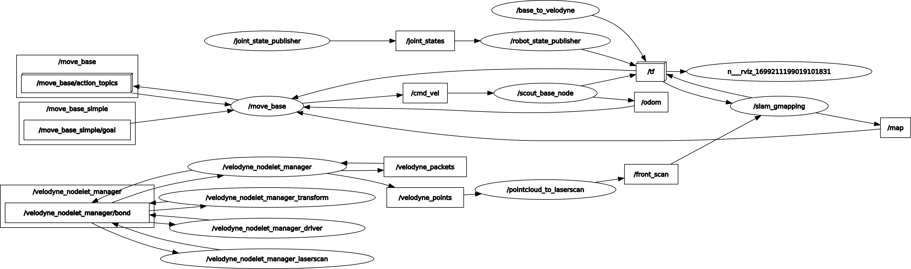
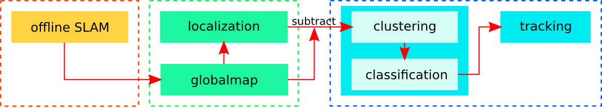

# Real Time Human Detection with 3D Lidar data
[The project](https://github.com/domrachev03/Real-Life-Human-Detection-with-3D-Lidar-data.git) is aimed to detect a human using data from the 3D lidar. The calculations would be performed in real time on a single board computer.

<center>
    <figure>
    
    </figure>
</center>


## Project Participants
1. Domraсhev Ivan, i.domrachev@innopolis.university
2. Eremov Artur, a.eremov@innopolis.university
3. Kiselyov Ivan, i.kiselyov@innopolis.university


## Description
The project is industry motivated, since this is very close to a real-life goal of one of the start-ups in the Innopolis University. The data from the model would be postprocessed and published to a navigation algorithm, which would allow to autonomous vehicle follow the person. The lidar is used for other means, and it would be fortunate if it would allow not to install the camera specifically for this task.

The current hardware setup is following:
1. Mobile Platform [AgileX Scout Mini](https://global.agilex.ai/products/scout-mini)
2. 3D lidar [Velodyne Puck](https://velodynelidar.com/products/puck/)
3. Single Board computer [Jetson Nano 8Gb](https://developer.nvidia.com/embedded/jetson-nano-developer-kit)

<center>
    <figure>
    
    <figcaption>The rqt_graph of the software implemented on hardware setup</figcaption>
    </figure>
</center>

Also, the Robotics Operating System (ROS) enviroment with other algorithms for autonomous navigation are already implements

## The algorithm
The idea of the resulting algorithm is straightforward: the pointcloud is first filtered by the algorithm itself, then it's passed to a [unsupervised clusterization algorithm](https://userpages.uni-koblenz.de/~agas/Documents/Haeselich2014CBP.pdf), which selects many regions of interest, which are then classified by slower, but more accurate [human classifier](https://www.aisl.cs.tut.ac.jp/~jun/pdffiles/kidono-iv2011.pdf).
<center>
    <figure>
    
    </figure>
</center>

## Structure
```bash
├── existing_models
│   ├── datasets                         # The ipynb scripts to setup the datasets
│   │   ├── KITTI_dataset
│   │   └── nuScenes_dataset
│   └── LidarTracking3D                  # ROS package for testing different solutions
│       └── src                          # Different examined packages
│           ├── hdl_people_tracking               
│           ...
│           └── patchwork-plusplus-ros   # Floor removal
├── Lidar-Simulator                      # The forked simulator of lidar data
├── reports                              # The markdown reports with stages of project development 
│   └── img                              # The reference images
└── src                                  # The ROS package for human detection
    ├── agilex_scout_mini                # Package for connection to the robot
    ├── human_detection                  # Improved human detection algorithm
    └── rosbag2video                     # The package for handling dataset collection
```

## Dependencies
1. [ROS Noetic](http://wiki.ros.org/noetic)
2. ROS packages: move_base, gmapping, pcl_ros, pcl_conversions, nodelet, message_filters, sensor_msgs
3. [PCL](https://pointclouds.org/), [Eigen](https://eigen.tuxfamily.org/index.php?title=Main_Page)
4. [fast_gicp](https://github.com/SMRT-AIST/fast_gicp/tree/6d99a9cfb211d87858921f3711141c36d6ea39c8), [hdl_global_localization](https://github.com/koide3/hdl_global_localization/tree/a69c16b1b89d700cd5283f6a89ac843d69c037cc), [hdl_localization](https://github.com/koide3/hdl_localization/tree/8ba183ca49a1d6b290d965d3852793287b31a9f4), [ndt_omp](https://github.com/koide3/ndt_omp/tree/0852c95360d1b0d29745e7eae7a57c0950de695b)

## Installation
> Note: the proper dependencies handling is in-progress task, for now this section assumes you've installed the deps manually

All you need to install this repository is to initialize and compile ROS workspace:
```bash
mkdir -p catkin_ws/src
cd catkin_ws/src
git clone https://github.com/domrachev03/Real-Life-Human-Detection-with-3D-Lidar-data
cd ..
catkin init 
catkin build
```

## Usage
To run the sample problems using the benchmark datasets, run:
```bash
source devel/setup.{bash/zsh/...}
roslaunch lidar_tracker_validation validate_tracker.launch model_name:={"kf_tracker/Track3D/kf_tracker"} rosbag_filename={rosbag_file.bag}
```
for details, see [report #1](https://github.com/domrachev03/Real-Life-Human-Detection-with-3D-Lidar-data/blob/master/reports/Report%231.md)

To record the rosbag from the robot, run:
```bash
roslaunch human_detection record_with_camera.launch camera_fps:=10 record_rosbag:=true
```

To launch the human detection on the robot, run:
```bash
roslaunch human_detection human_detection.launch
```


## Roadmap
- [X] Designing a pipeline
- [X] Researching for existing solutions
- [X] Integrating a solution with ROS environment
- [X] Collecting the dataset
- [X] Implementing human detection pipeline
- [X] Implementing human following
- [X] Optimizing the performance

## Possible improvement
- [ ] Run proper evaluation of the algorithm on the datasets like [KITTI](https://www.cvlibs.net/datasets/kitti) and/or others.
- [ ] Add the tracking task for the robot based on the tracking of chosen person (plan path to the chosen point, namely nearby the person).
- [ ] Try to optimize the model even further without drastic accuracy loss. Our team failed to find a way to speed up the computation further without loss of the accuracy.


## Acknowledgement
Our team would like to thanks the team of Practical Machine Learning and Deep Learning course in Innopolis University for providing necessary knowledge and assistance in project completion. Special thanks to Vladimir Ivanov and Maxim Evgragov for tutorship and answering our questions.
